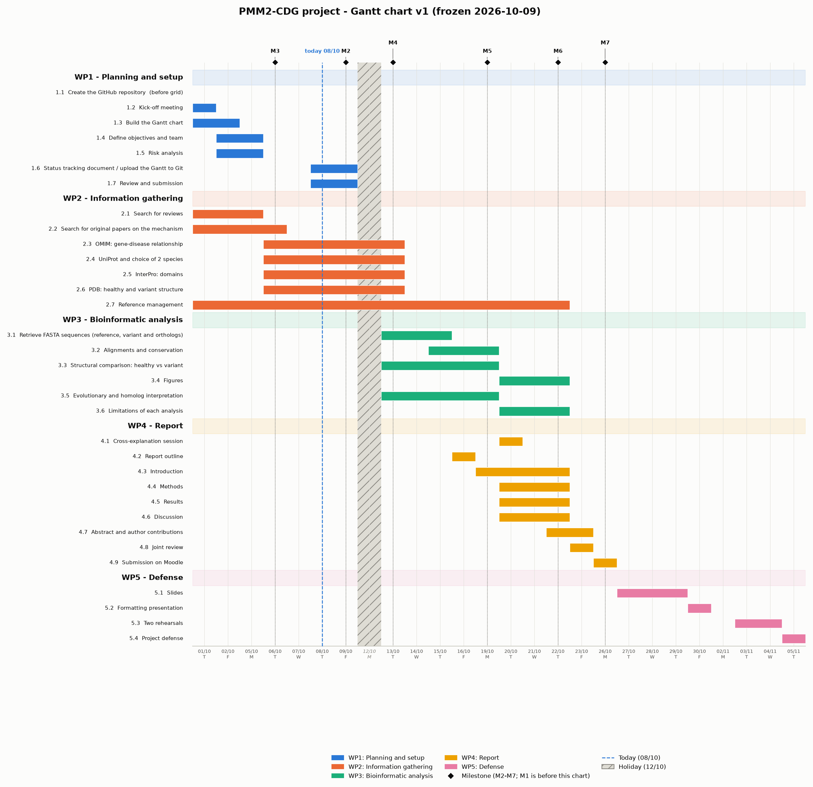

# Gantt v1 - frozen 2026-10-09

This is the Gantt chart as it stood for the 09/10 submission. See [`../README.md`](../README.md) for frozen vs. live. Source data: [`gantt_v1.xlsx`](gantt_v1.xlsx); rendered chart: `gantt_v1.png`.

Working-day calendar: Monday-Friday, holidays 11/09, 24/09, 12/10 and 08/12 excluded (see the `Holidays` sheet in the workbook). Durations below are working days (`NETWORKDAYS`), not calendar days. Task 1.1 (17/09) falls before the chart's 01/10 start and is not shown in the PNG bar area.

## WP1 - Planning and setup

Planned: 17/09/2026 -> 09/10/2026 (16 working days)

| ID | Task | Owner | Predecessor | Plan. start | Plan. end | Working days | Output / accomplished when |
|---|---|---|---|---|---|---|---|
| 1.1 | Create the GitHub repository | Dàlia + Salomé | - | 17/09/2026 | 17/09/2026 | 1 | Repository with folders, README and .gitignore (before grid: 17/09 is earlier than the 01/10 grid start) |
| 1.2 | Kick-off meeting | All | 1.1 | 01/10/2026 | 01/10/2026 | 1 | Organisation and brainstorming |
| 1.3 | Build the Gantt chart | Dàlia + Noah | 1.2 | 01/10/2026 | 02/10/2026 | 2 | Complete Gantt chart |
| 1.4 | Define objectives and team | Adriana | 1.3 | 02/10/2026 | 05/10/2026 | 2 | Objectives, roles and background written in the README |
| 1.5 | Risk analysis | Elsa | 1.3 | 02/10/2026 | 05/10/2026 | 2 | Risk matrix and risk statements |
| 1.6 | Status tracking document / upload the Gantt to Git | Dàlia + Noah | 1.5 | 08/10/2026 | 09/10/2026 | 2 | Table in status/ |
| 1.7 | Review and submission | Dàlia | 1.6 | 08/10/2026 | 09/10/2026 | 2 | Upload to Moodle and update the Gantt |

## WP2 - Information gathering

Planned: 01/10/2026 -> 22/10/2026 (15 working days)

| ID | Task | Owner | Predecessor | Plan. start | Plan. end | Working days | Output / accomplished when |
|---|---|---|---|---|---|---|---|
| 2.1 | Search for reviews | Salomé | 1.4 | 01/10/2026 | 05/10/2026 | 3 | At least 3 reviews |
| 2.2 | Search for original papers on the mechanism | Salomé | 2.1 | 01/10/2026 | 06/10/2026 | 4 | At least 5 papers |
| 2.3 | OMIM: gene-disease relationship | Adriana | 2.2 | 06/10/2026 | 13/10/2026 | 5 | Notes on the gene and the phenotype |
| 2.4 | UniProt and choice of 2 species | Adriana | 2.3 | 06/10/2026 | 13/10/2026 | 5 | Protein entry and justification of the species |
| 2.5 | InterPro: domains | Elsa | 2.4 | 06/10/2026 | 13/10/2026 | 5 | List of domains |
| 2.6 | PDB: healthy and variant structure | Elsa | 2.5 | 06/10/2026 | 13/10/2026 | 5 | Selected PDB IDs |
| 2.7 | Reference management | Salomé | 2.1 | 01/10/2026 | 22/10/2026 | 15 | List in BMC format |

## WP3 - Bioinformatic analysis

Planned: 13/10/2026 -> 22/10/2026 (8 working days)

| ID | Task | Owner | Predecessor | Plan. start | Plan. end | Working days | Output / accomplished when |
|---|---|---|---|---|---|---|---|
| 3.1 | Retrieve FASTA sequences (reference, variant and orthologs) | Dàlia | 2.6 | 13/10/2026 | 15/10/2026 | 3 | FASTA files |
| 3.2 | Alignments and conservation | Dàlia | 3.1 | 15/10/2026 | 19/10/2026 | 3 | Alignment and conservation table |
| 3.3 | Structural comparison: healthy vs variant | Noah | 3.1 | 13/10/2026 | 19/10/2026 | 5 | Images and notes |
| 3.4 | Figures | Dàlia + Noah | 3.2, 3.3 | 20/10/2026 | 22/10/2026 | 3 | Figures in figures/ |
| 3.5 | Evolutionary and homolog interpretation | Noah | 3.2 | 13/10/2026 | 19/10/2026 | 5 | Interpretation notes |
| 3.6 | Limitations of each analysis | Adriana | 3.3, 3.5 | 20/10/2026 | 22/10/2026 | 3 | Limitations summary (to be integrated into the Discussion section) |

## WP4 - Report

Planned: 16/10/2026 -> 26/10/2026 (7 working days)

| ID | Task | Owner | Predecessor | Plan. start | Plan. end | Working days | Output / accomplished when |
|---|---|---|---|---|---|---|---|
| 4.1 | Cross-explanation session | All | 3.6 | 20/10/2026 | 20/10/2026 | 1 | - |
| 4.2 | Report outline | Salomé | 4.1 | 16/10/2026 | 16/10/2026 | 1 | Report outline (.md file with the BMC sections) |
| 4.3 | Introduction | Salomé | 4.2 | 19/10/2026 | 22/10/2026 | 4 | - |
| 4.4 | Methods | Noah | 4.2 | 20/10/2026 | 22/10/2026 | 3 | - |
| 4.5 | Results | Dàlia | 4.2, 3.6 | 20/10/2026 | 22/10/2026 | 3 | - |
| 4.6 | Discussion | Adriana | 4.5 | 20/10/2026 | 22/10/2026 | 3 | - |
| 4.7 | Abstract and author contributions | Elsa | 4.3, 4.4, 4.5, 4.6 | 22/10/2026 | 23/10/2026 | 2 | - |
| 4.8 | Joint review | All | 4.7 | 23/10/2026 | 23/10/2026 | 1 | - |
| 4.9 | Submission on Moodle | Adriana | 4.8 | 26/10/2026 | 26/10/2026 | 1 | - |

## WP5 - Defense

Planned: 27/10/2026 -> 05/11/2026 (8 working days)

| ID | Task | Owner | Predecessor | Plan. start | Plan. end | Working days | Output / accomplished when |
|---|---|---|---|---|---|---|---|
| 5.1 | Slides | All | 4.9 | 27/10/2026 | 29/10/2026 | 3 | - |
| 5.2 | Formatting presentation | Elsa | 5.1 | 30/10/2026 | 30/10/2026 | 1 | - |
| 5.3 | Two rehearsals | All | 5.2 | 03/11/2026 | 04/11/2026 | 2 | - |
| 5.4 | Project defense | All | 5.3 | 05/11/2026 | 05/11/2026 | 1 | - |

## Whole project

Planned: 17/09/2026 -> 05/11/2026 (34 working days)

## Milestones

Wording is the exact original list from `project_bioinfo_objectives.docx`; only the dates and the task basis are new.

| ID | Milestone | Date | Basis |
|---|---|---|---|
| M1 | Github repository created | 17/09/2026 | 1.1 end (before grid) |
| M2 | Have the project defined | 09/10/2026 | 1.6/1.7 end |
| M3 | Relevant research/scientific papers selected | 06/10/2026 | 2.2 end |
| M4 | Theoretical biological background completed | 13/10/2026 | 2.3-2.6 end |
| M5 | Have done the comparison with the variant | 19/10/2026 | 3.3 end |
| M6 | Have analyzed the results and defined the conclusions | 22/10/2026 | 4.6 end |
| M7 | Final scientific article submitted | 26/10/2026 | 4.9 end |

## Risk cross-reference

Contingency plans for the project's critical risks (full statements and scoring in [`risk_analysis.md`](risk_analysis.md)), mapped onto the WPs and tasks they protect:

| Risk | Level | Affects | Contingency (summary) |
|---|---|---|---|
| R1 | Medium | All WPs | Backup person assigned per task; Project Status document kept current so anyone can take over within 24h. |
| R2 | High | WP2, WP3 | Save all retrieved data to the repo as soon as it's fetched; fall back to a homology model/alternative variant if no experimental structure exists. |
| R3 | Medium | All, esp. WP2 (2.1-2.7, running in parallel 01/10-13/10) | Monitor workload per member in the Project Status document; transfer tasks to a lighter-loaded member; review distribution weekly. |
| R4 | Medium | WP3, task 4.1 | Cross-check results between two members during the cross-explanation session (4.1); document parameters used; consult the instructor if in doubt. |
| R5 | Low | WP4 | Agree on citation style/format/template in advance; joint review (4.8) before submission. |
| R6 | High | WP3 | Leave a 2-working-day margin before report writing starts; share partial results early; reassign a member with free capacity. |
| R7 | Medium | WP4 (4.8, 4.9) | Finish the joint review (4.8) at least one working day before the 26/10 deadline; submit early; keep a verified backup copy of the repo and report. |

## Predecessors - please check

Predecessors were inferred from the logical order of the tasks (not recorded in the original file) - please review the `Predecessor` column in each WP table above and flag anything that should be different.

